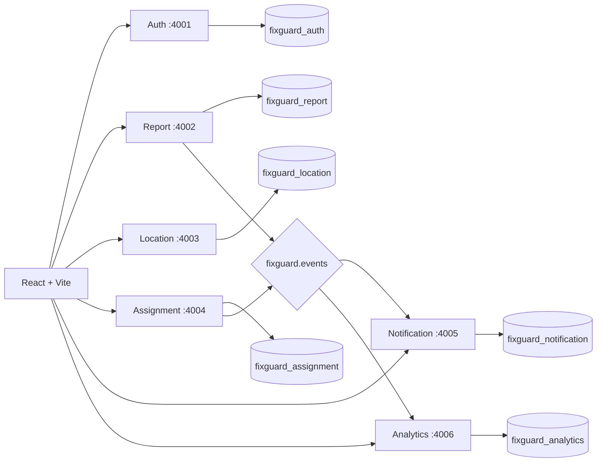
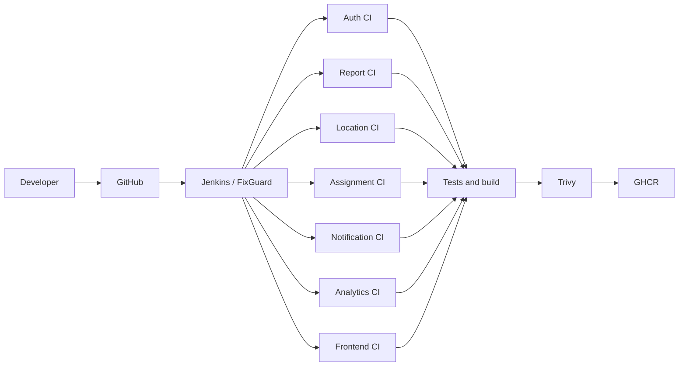

# FixGuard

FixGuard is a portfolio-ready civic infrastructure reporting platform. Citizens report local issues and follow resolution progress; municipal administrators verify reports, coordinate maintenance teams, manage service areas, and inspect operational analytics.

## Architecture



REST handles synchronous commands and queries. RabbitMQ handles asynchronous report and assignment events. Each service owns one PostgreSQL database and consumers write only to their own database.

## Technology

React, Vite, Node.js, Express, PostgreSQL, Prisma, Zod, JWT, bcrypt, RabbitMQ, Docker, and Docker Compose.

## Features

Citizens can register, manage profiles, submit location-aware reports, track report and assignment progress, and manage event-driven notifications. Administrators manage users, reports, priorities, locations, service zones, teams, assignments, lifecycle transitions, and operational analytics.

## Services and ports

| Component | Port |
|---|---:|
| Frontend | 5173 |
| Auth | 4001 |
| Report | 4002 |
| Location | 4003 |
| Assignment | 4004 |
| Notification | 4005 |
| Analytics | 4006 |
| PostgreSQL host mapping | 5433 |
| RabbitMQ AMQP | 5672 |
| RabbitMQ Management | 15672 |

## Environment and local development

Copy `.env.example` to an ignored `.env`, replace every placeholder, and keep secrets out of source control. Frontend configuration is documented in `frontend/.env.example`.

```powershell
docker compose config --quiet
docker compose up -d --build
docker compose ps
```

The RabbitMQ Management UI is available at `http://localhost:15672` using credentials from `.env`. See [PHASE6.md](PHASE6.md) for event contracts, queues, idempotency, and DLQs.

## Testing

Each backend service is independently reproducible:

```powershell
cd services/auth-service
npm ci
npm test
docker build .
```

Use the same commands for Report, Location, Assignment, Notification, and Analytics. Validate the frontend with `npm ci`, `npm test`, and `npm run build`. Tests return non-zero on failure and lock files are committed.

## CI/CD architecture



Each component owns an independent Jenkinsfile. Its pipeline checks out the repository, verifies the environment and lock file, runs `npm ci`, generates Prisma clients where applicable, enforces tests, builds one Docker image, checks the image context for secret-bearing files, scans with Trivy, and conditionally publishes to GHCR. The root [Jenkinsfile](Jenkinsfile) performs parallel full-project validation for major changes.

Images use `ghcr.io/akshara-minoli/fixguard-<component>:<12-character-commit-sha>`. Successful `main` builds also update `latest`; branches and pull requests validate without pushing. `HIGH` vulnerabilities are reported, while unfixed `CRITICAL` vulnerabilities fail the pipeline. `npm audit` is informational and never mutates lock files.

Jenkins binds GHCR credentials from the credentials-store ID `ghcr-credentials`; no registry secret is stored in a Jenkinsfile. Local/private Jenkins should use **Build Now** or safe SCM polling unless a webhook endpoint can be exposed securely. Configure each monorepo job with the include region for its component—for example, `services/report-service/.*` for Report CI—so unrelated services are not rebuilt.

See [Jenkins setup and operations](docs/JENKINS.md) for job paths, Docker access, credentials, branch behavior, failure-gate testing, and security implications.

## Security

Backend JWT/RBAC enforcement is authoritative. Internal endpoints use a separate service key. Inputs are validated with Zod, Express services use Helmet and bounded JSON bodies, and application errors avoid exposing infrastructure details.

## Future DevOps work

Kubernetes deployment, monitoring, centralized logging, and a transactional event outbox remain future phases. Jenkins intentionally stops after publishing scanned, versioned images to GHCR.
