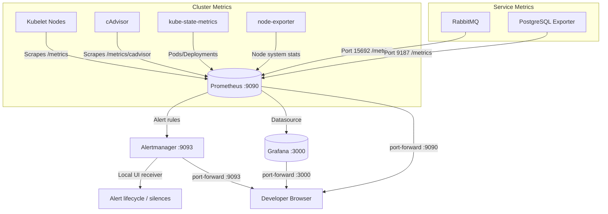

# FixGuard Monitoring System (Phases 10.1-10.5)

This directory contains the Kubernetes manifests to deploy a standalone Prometheus + Grafana
monitoring stack in the local environment, collecting core cluster, node, RabbitMQ, and
PostgreSQL metrics and visualising them in pre-built dashboards.

## Architecture



---

## Deployment Strategy

We use standalone Kubernetes manifests (instead of a complex Helm chart or operator setup) to
ensure a lightweight footprint suitable for local Docker Desktop development.  Scraping
configuration uses standard annotations on Services to dynamically auto-discover endpoints.
Grafana is provisioned fully declaratively via ConfigMaps — no manual click-ops are required.

- **Namespace**: `monitoring`
- **Prometheus retention**: 7 days (`--storage.tsdb.retention.time=7d`)
- **Prometheus storage**: 5 Gi PVC
- **Grafana storage**: 2 Gi PVC

---

## Folder Directory Structure

```text
monitoring/
├── namespace.yaml
├── README.md
├── prometheus/
│   ├── clusterrole.yaml
│   ├── configmap.yaml
│   ├── deployment.yaml
│   ├── service.yaml
│   ├── node-exporter.yaml
│   ├── kube-state-metrics.yaml
│   └── postgres-exporter.yaml
└── grafana/
    ├── grafana-secrets.yaml
    ├── configmap-datasource.yaml
    ├── configmap-dashboards.yaml
    ├── configmap-dashboard-json.yaml
    ├── deployment.yaml
    ├── service.yaml
    └── README.md
```

---

## Exporters & Targets Collected

1. **Prometheus Server**: Scrapes itself on port 9090.
2. **Kubelet & cAdvisor**: Proxied via API server on port 443 (targets nodes CPU/memory/system metrics).
3. **Kube State Metrics**: Service endpoint metrics on port 8080 (scrapes pod readiness, deployment available replicas, restart counters).
4. **Node Exporter**: DaemonSet on port 9100 (scrapes host node metrics).
5. **RabbitMQ Metrics**: Built-in Prometheus plugin on port 15692 (scrapes queue depth, consumer count, message rates).
6. **PostgreSQL Exporter**: Sidecar-style exporter on port 9187 (scrapes transactional status, client connections, buffer stats) using the dedicated database user `postgres_exporter` with `pg_monitor` privileges.

---

## Grafana Dashboards (Phase 10.2)

Three dashboards are pre-provisioned in the **FixGuard** folder:

| Dashboard | Key Panels |
|---|---|
| **FixGuard — Cluster Overview** | Nodes ready, pods running, node CPU %, node memory %, pod readiness table, deployment replica table |
| **FixGuard — Application Services** | RabbitMQ queue depth, consumers, publish/deliver rate, per-service container CPU & memory |
| **FixGuard — PostgreSQL** | `pg_up`, active connections, transactions/sec, rows CRUD rate, cache hit ratio, per-database summary |

---

## Setup and Verification

### 1. Database Exporter Role Configuration

Ensure that the dedicated monitoring role exists inside PostgreSQL:
```bash
kubectl -n fixguard exec -it postgres-0 -- env PGPASSWORD=<postgres_root_password> psql -U fixguard_admin -d postgres -c "CREATE ROLE postgres_exporter WITH LOGIN PASSWORD '<password>'; GRANT pg_monitor TO postgres_exporter;"
```

### 2. Exporter Secrets Deployment

Create the connection secret in the `monitoring` namespace:
```bash
kubectl -n monitoring create secret generic postgres-exporter-secrets --from-literal=DATA_SOURCE_NAME="postgresql://postgres_exporter:<password>@postgres.fixguard.svc.cluster.local:5432/postgres?sslmode=disable"
```

### 3. Deploy manifests

Apply the namespaces, updated RabbitMQ ports, and all monitoring components:
```bash
# Update RabbitMQ Service/StatefulSet
kubectl apply -f infrastructure/kubernetes/rabbitmq/

# Deploy Prometheus Namespace & Infrastructure
kubectl apply -f infrastructure/kubernetes/monitoring/namespace.yaml
kubectl apply -f infrastructure/kubernetes/monitoring/prometheus/

# Deploy Grafana (Phase 10.2)
kubectl apply -f infrastructure/kubernetes/monitoring/grafana/
```

### 4. Local Browser Access — Prometheus

Prometheus is configured as a `ClusterIP` service to prevent public exposure:
```bash
kubectl -n monitoring port-forward service/prometheus 9090:9090
```
Open **[http://localhost:9090](http://localhost:9090)** in your browser.

### 5. Local Browser Access — Grafana

```bash
kubectl -n monitoring port-forward service/grafana 3000:3000
```
Open **[http://localhost:3000](http://localhost:3000)** and log in:
- **Username**: `admin`
- **Password**: `fixguard-grafana` (defined in `grafana/grafana-secrets.yaml`)

The three FixGuard dashboards are available under **Dashboards → FixGuard**.

---

## Centralized Logging (Phase 10.3)

Loki `3.4.3` runs in single-binary mode with a 3 Gi PVC and seven-day retention.
Alloy `1.8.3` discovers only `fixguard` pods, streams stdout/stderr through the
Kubernetes API, and forwards it to Loki. Grafana provisions Loki at
`http://loki.monitoring.svc.cluster.local:3100` as a secondary datasource, so
Prometheus remains the default.

Deploy in dependency order:

```bash
kubectl apply -f infrastructure/kubernetes/monitoring/loki/
kubectl apply -f infrastructure/kubernetes/monitoring/alloy/
kubectl apply -f infrastructure/kubernetes/monitoring/grafana/
```

Open **Grafana -> Explore -> Loki** or the provisioned **FixGuard Logs** dashboard.
Useful labels are `namespace`, `pod`, `container`, `app`, and `component`.

```logql
{namespace="fixguard"}
{namespace="fixguard", container="auth-service"}
{namespace="fixguard"} |= "error"
{namespace="fixguard"} |~ "(?i)rabbit"
```

Troubleshooting:

```bash
kubectl -n monitoring get deploy/loki daemonset/alloy pvc/loki-storage
kubectl -n monitoring logs deployment/loki --tail=100
kubectl -n monitoring logs daemonset/alloy --tail=100
kubectl -n monitoring port-forward service/loki 3100:3100
curl http://localhost:3100/ready
curl http://localhost:3100/loki/api/v1/labels
```

## Useful PromQL Queries

| Query | Description |
|---|---|
| `up` | Check status of all scrape targets (`1` is UP, `0` is DOWN). |
| `kube_pod_status_ready{namespace="fixguard"}` | Verify readiness of pods in the application namespace. |
| `kube_deployment_status_replicas_available{namespace="fixguard"}` | Verify replica counts for running microservices. |
| `container_cpu_usage_seconds_total{namespace="fixguard"}` | Track container CPU consumption rates. |
| `container_memory_working_set_bytes{namespace="fixguard"}` | Track container active memory footprint. |
| `rabbitmq_queue_messages` | Monitor active RabbitMQ queue lengths. |
| `pg_up` | Monitor PostgreSQL Exporter database connectivity. |
| `pg_stat_database_xact_commit` | Track transactions committed in PostgreSQL databases. |

---

## Prometheus Alerting (Phase 10.4)

Alertmanager `v0.33.1` is an internal `ClusterIP` service. Prometheus evaluates
rules from `prometheus/rules/alerts.yaml` and sends firing alerts to
`alertmanager.monitoring.svc.cluster.local:9093`. The `local-ui` receiver has no
external integration or credentials; it provides safe local lifecycle, grouping,
and silence verification.

```bash
kubectl apply -f infrastructure/kubernetes/monitoring/alertmanager/
kubectl apply -f infrastructure/kubernetes/monitoring/prometheus/rules/
kubectl apply -f infrastructure/kubernetes/monitoring/prometheus/
kubectl -n monitoring port-forward service/alertmanager 9093:9093
```

Open <http://localhost:9093>. Prometheus rules and their `inactive`, `pending`, or
`firing` states are visible at <http://localhost:9090/rules> and
<http://localhost:9090/alerts>. To silence an alert, use **Silences -> New
silence**, add narrow label matchers such as `alertname` and `namespace`, set a
short duration and comment, then create the silence.

| Alert | Severity | Purpose |
|---|---|---|
| `FixGuardServiceDown` | critical | Desired deployment replicas are unavailable |
| `FixGuardPodNotReady` | warning | Running or pending pod remains unready |
| `FixGuardContainerRestarts` | warning | Two or more restarts in ten minutes |
| `FixGuardHighCPU` | warning | Pod exceeds 0.8 cores for five minutes |
| `FixGuardHighMemory` | warning | Pod exceeds 85% of its memory limit |
| `RabbitMQDown` | critical | RabbitMQ target is unavailable |
| `RabbitMQQueueBacklog` | warning | Non-DLQ queue holds over 100 messages |
| `RabbitMQDeadLetterQueueNotEmpty` | warning | A DLQ remains non-empty |
| `PostgreSQLDown` | critical | Exporter cannot connect to PostgreSQL |
| `MonitoringTargetDown` | critical | A critical internal exporter is unavailable |

Severity convention: `info` is for controlled tests or informational conditions,
`warning` is actionable degradation, and `critical` is service or dependency
unavailability requiring prompt action.

Troubleshooting:

```bash
kubectl -n monitoring get pods,svc
kubectl -n monitoring logs deployment/alertmanager --tail=100
kubectl -n monitoring logs deployment/prometheus --tail=100
kubectl -n monitoring exec deployment/prometheus -- promtool check config /etc/prometheus/prometheus.yml
kubectl -n monitoring get --raw /api/v1/namespaces/monitoring/services/http:prometheus:9090/proxy/api/v1/rules
kubectl -n monitoring get --raw /api/v1/namespaces/monitoring/services/http:alertmanager:9093/proxy/api/v2/status
```

If rules are absent, verify the `prometheus-rules` ConfigMap mount and restart
only the Prometheus Deployment. If alerts do not arrive, inspect Prometheus
runtime information and both service endpoints.

## Intentionally Deferred Features

The following components are deferred to subsequent phases:
- **Phase 10.6**: Chaos engineering and cluster failure simulations.

Phase 10.5 SLI/SLO targets, measurements, error budgets, limitations, and PromQL
examples are documented in [`slo/README.md`](slo/README.md). Grafana provisions
the **FixGuard SRE / SLO Overview** dashboard alongside the existing dashboards.
